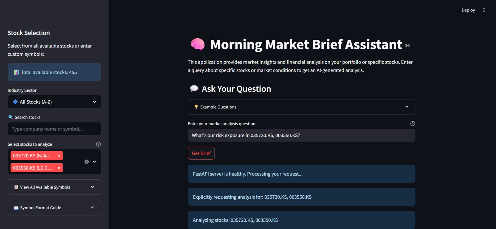
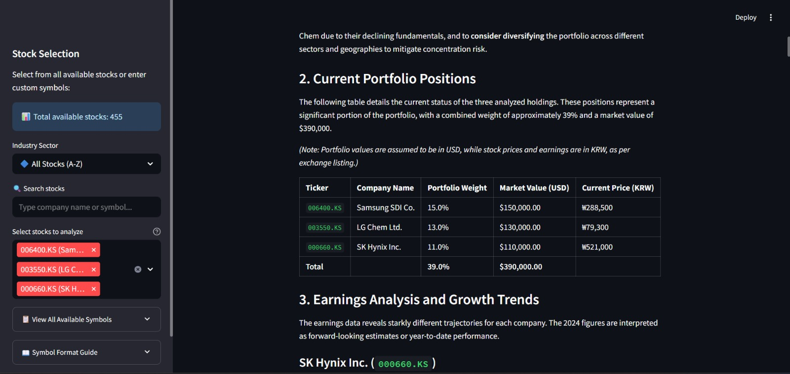
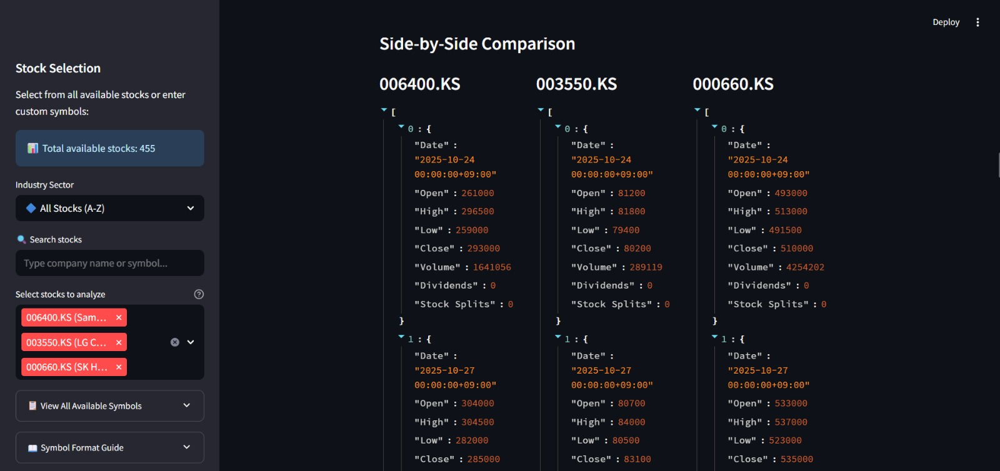
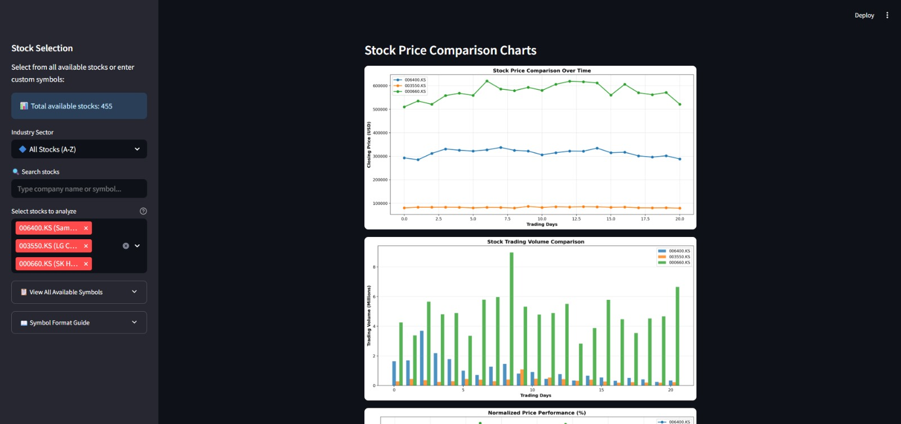

# Multi-Agent AI Finance Assistant


## Overview

The **Multi-Agent AI Finance Assistant** is an open-source platform designed to provide intelligent financial analysis and decision-making support using a multi-agent AI framework. Leveraging large language models (Google Gemini) and advanced financial algorithms, this project enables users to perform tasks such as equity research, market forecasting, portfolio optimization, risk assessment, and earnings predictions. The system employs a modular, agent-based architecture where specialized AI agents collaborate to deliver precise and actionable financial insights.

**Key Capabilities:**
- 📊 **460+ Global Stocks**: Coverage of US, Asian, European markets, ETFs, and cryptocurrencies
- 🤖 **AI-Powered Analysis**: Multi-agent system with specialized financial agents
- 📈 **Earnings Predictions**: ML-based earnings forecasting with visualization
- 📰 **Real-time News**: Automated news scraping and analysis
- 🎯 **Risk Assessment**: Portfolio exposure and risk analysis
- 📉 **Interactive Charts**: Stock comparisons, growth trends, and performance metrics

This project is ideal for financial analysts, developers, and researchers looking to harness AI for financial applications. It demonstrates the power of multi-agent systems in tackling complex, real-world financial challenges.

---

## 🚀 Live Demo (Beta)

🟡 Under development: [multi-agent-ai-finance-assistant.streamlit.app](https://multi-agents-finance-assistant.streamlit.app)  

---

## ⚠️ Note

> Due to limitations of **Render's free trial**, the **FastAPI backend may not load in the Streamlit frontend** (which is still under development).  
> **Recommended:** Clone the repo and run it locally for a seamless experience.

---

🧪 Try locally: Follow setup instructions below.

---


## Key Features

- **Multi-Agent Collaboration**: Specialized agents (API Agent, Scraping Agent, Retriever Agent, Analysis Agent, Language Agent, Prediction Agent, Graphing Agent, Voice Agent) work together to process financial data and provide comprehensive insights.
- **LLM-Powered Analysis**: Integrates Google Gemini (gemini-2.0-flash-exp, gemini-2.5-pro) for natural language understanding and financial reasoning with intelligent fallback mechanisms.
- **Financial Data Integration**: 
  - Real-time market data via Yahoo Finance API
  - 460+ stocks from major global exchanges (US, Korea, Japan, Hong Kong, India, UK, Germany, France, Switzerland, Canada, Australia)
  - 98 ETFs covering various sectors and strategies
  - 20+ cryptocurrencies including Bitcoin, Ethereum, and major altcoins
- **Advanced Analytics**:
  - Portfolio risk exposure analysis with customizable weights
  - ML-based earnings predictions using polynomial regression
  - Year-over-year growth trend forecasting
  - Historical vs predicted earnings visualization
- **Interactive Visualizations**:
  - Side-by-side stock comparison charts
  - Normalized price performance tracking
  - Volume analysis and trading patterns
  - Combined earnings and growth analysis
- **Intelligent Stock Selection**:
  - Browse by category (Tech Giants, Banking, Semiconductors, etc.)
  - Search by company name or symbol
  - Custom symbol entry for any Yahoo Finance ticker
- **Report Generation**: Automatically generates professional market briefs with real Yahoo Finance data and AI analysis.
- **Extensible Architecture**: Modular design allows easy addition of new agents or data sources.
- **Multiple Deployment Options**: Run as combined app or separated frontend/backend architecture.

---

---
## 📸 Screenshots

### 🧠 Home Dashboard with Stock Selection

*Select from 460+ global stocks across categories or search by name/symbol*

### 📊 Market Brief Analysis

*AI-powered market analysis with portfolio risk assessment and earnings data*

### 📈 Stock Comparison Charts

*Side-by-side comparison with price trends, volume analysis, and performance metrics*

### 📉 Earnings & Growth Trend Analysis

*Historical vs predicted earnings with ML-based forecasting and growth trends*


---

## 🧰 Tech Stack

- **Frontend:** Streamlit + Interactive Charts (Matplotlib) + Stock Selection UI
- **Backend:** FastAPI (RESTful Microservices Architecture)
- **Data Sources:** 
  - Yahoo Finance API (yfinance) for real-time market data
  - BeautifulSoup & Newspaper3k for news scraping
- **AI/ML:**
  - Google Gemini (gemini-2.0-flash-exp, gemini-2.5-pro) via google-generativeai
  - LangChain for RAG implementation
  - Scikit-learn for earnings prediction (polynomial regression)
  - FAISS for vector similarity search
- **Data Processing:** Pandas, NumPy for financial data analysis
- **Voice I/O:** SpeechRecognition + gTTS for voice interactions
- **Deployment:** 
  - Single-file deployment (app.py) for combined FastAPI + Streamlit
  - Separated deployment (orchestrator + streamlit_app) for scalability
  - Docker-ready with multi-stage builds
  - Render/Streamlit Cloud compatible

---

## 🧪 AI Agents Overview

| Agent            | Role                                               | Technology |
|------------------|----------------------------------------------------|------------|
| **API Agent** (`api_agent.py`) | Fetches real-time market data from Yahoo Finance, handles data serialization | yfinance, pandas |
| **Scraping Agent** (`scrapping_agent.py`) | Scrapes financial news with intelligent fallback mechanisms | newspaper3k, BeautifulSoup |
| **Retriever Agent** (`retriever_agent.py`) | Implements RAG with FAISS vector store for document retrieval | LangChain, FAISS |
| **Language Agent** (`language_agent.py`) | Generates market briefs using Google Gemini with fallback handling | google-generativeai, Gemini 2.0/2.5 |
| **Analysis Agent** (`analysis_agent.py`) | Calculates portfolio risk exposure and performs statistical analysis | pandas, NumPy |
| **Prediction Agent** (`prediction_agent.py`) | Forecasts earnings and growth rates using ML regression | scikit-learn, NumPy |
| **Graphing Agent** (`graphing_agent.py`) | Creates interactive visualizations and comparison charts | matplotlib, pandas |
| **Voice Agent** (`voice_agent.py`) | Handles speech-to-text and text-to-speech interactions | SpeechRecognition, gTTS |
| **Simple Retriever Agent** (`simple_retriever_agent.py`) | Lightweight retrieval for quick queries | Custom implementation |

---


## Project Motivation

The financial industry demands rapid, accurate, and data-driven decisions. Traditional tools often struggle with the volume and complexity of financial data. This project addresses these challenges by deploying a multi-agent AI system that combines domain expertise with cutting-edge AI technologies, inspired by platforms like FinRobot.

## Installation

### Prerequisites
- Python 3.10 or higher
- Git
- Google Gemini API key (Get it free from [Google AI Studio](https://ai.google.dev/))
- Optional: Docker for containerized deployment

### Setup

1. **Clone the Repository**:
   ```bash
   git clone https://github.com/vansh-121/Multi-Agent-AI-Finance-Assistant.git
   cd Multi-Agent-AI-Finance-Assistant
   ```

2. **Create a Virtual Environment**:
   ```bash
   python -m venv venv
   source venv/bin/activate  # On Windows: venv\Scripts\activate
   ```

3. **Install Dependencies**:
   ```bash
   pip install -r requirements.txt
   ```

4. **Configure API Keys**:
   Create a `.env` file in the root directory:
   ```bash
   GEMINI_API_KEY="your-gemini-api-key-here"
   ```
   Get your free API key from: https://ai.google.dev/

### Running the Application

#### Option 1: Combined Mode (Single File - Recommended for Local Development)
Run both FastAPI backend and Streamlit frontend together:
```bash
streamlit run app.py
```
Access the app at: http://localhost:8501

#### Option 2: Separated Mode (Production Deployment)

**Terminal 1 - Start FastAPI Backend:**
```bash
uvicorn orchestrator.orchestrator:app --host 0.0.0.0 --port 8000
```

**Terminal 2 - Start Streamlit Frontend:**
```bash
streamlit run streamlit_app/app.py
```

Access the app at: http://localhost:8501  
API docs available at: http://localhost:8000/docs

#### Option 3: Docker Deployment
```bash
docker build -t finance-assistant .
docker run -p 8501:8501 -p 8000:8000 --env-file .env finance-assistant
```

### Usage Examples

1. **Browse by Category**: Select from Tech Giants, Banking, Semiconductors, etc.
2. **Search Stocks**: Type "Apple" or "TSLA" to find specific stocks
3. **Custom Symbols**: Enter any Yahoo Finance ticker (e.g., `AAPL, MSFT, TSM`)
4. **Ask Questions**: 
   - "Analyze AAPL, MSFT, and GOOGL. What's the market trend?"
   - "Compare Samsung (005930.KS) and TSMC performance"
   - "What's the risk exposure in my crypto portfolio?"

### Available Stock Coverage

- **248 US Stocks**: Major tech, finance, healthcare, retail, energy companies
- **49 Asian Stocks**: Korea (.KS), Japan (.T), Hong Kong (.HK), India (.NS)
- **40 European Stocks**: UK (.L), Germany (.DE), France (.PA), Switzerland (.SW)
- **98 ETFs**: Sector, index, and thematic ETFs
- **20 Cryptocurrencies**: BTC-USD, ETH-USD, and major altcoins
## 🆕 Latest Features

### Earnings Prediction & Visualization
- **ML-Based Forecasting**: Polynomial regression models predict future earnings
- **Growth Trend Analysis**: Year-over-year growth rate predictions
- **Interactive Charts**: Historical vs predicted earnings visualization
- **Comparison Tables**: Side-by-side metrics for multiple stocks

### Enhanced Stock Selection
- **460+ Global Stocks**: Comprehensive coverage across all major markets
- **Smart Search**: Find stocks by company name or symbol
- **Category Browsing**: Organized by sector and market
- **Custom Symbols**: Support for any Yahoo Finance ticker

### Intelligent Fallback System
- **Rate Limit Handling**: Automatic fallback when API limits are reached
- **Rich Fallback Data**: Market data enriched analysis even when news scraping fails
- **Graceful Degradation**: Always provides meaningful results

### API Features
- **RESTful Endpoints**: Clean API design with FastAPI
- **Health Checks**: Monitor system status at `/`
- **Debug Tools**: Test scraping at `/debug/test-scraping`
- **CORS Enabled**: Ready for frontend integration

## ⚠️ API Rate Limits

**Google Gemini Free Tier Limits:**
- `gemini-2.0-flash-exp`: 10 requests/min, 1500 requests/day
- `gemini-2.5-pro`: 50 requests/day

**Recommendations:**
1. Use `gemini-2.0-flash-exp` for high-frequency queries
2. Create multiple Google Cloud projects for extended quotas
3. Upgrade to paid tier for production use: https://ai.google.dev/pricing
4. System has intelligent fallback to ensure continuous operation

## 🏗️ Architecture

```
┌─────────────────────────────────────────────────────────────┐
│                     Streamlit Frontend                       │
│  (Stock Selection, Query Input, Visualization)              │
└────────────────────────┬────────────────────────────────────┘
                         │ HTTP/REST
                         ▼
┌─────────────────────────────────────────────────────────────┐
│                   FastAPI Orchestrator                       │
│              (Routes & Coordinates Agents)                   │
└───┬─────────┬─────────┬─────────┬─────────┬────────┬───────┘
    │         │         │         │         │        │
    ▼         ▼         ▼         ▼         ▼        ▼
┌────────┐ ┌────────┐ ┌────────┐ ┌────────┐ ┌────────┐ ┌────────┐
│  API   │ │Scraping│ │Retriever│ │Analysis│ │Language│ │Prediction│
│ Agent  │ │ Agent  │ │ Agent   │ │ Agent  │ │ Agent  │ │  Agent   │
└────────┘ └────────┘ └────────┘ └────────┘ └────────┘ └────────┘
    │         │         │         │         │        │
    ▼         ▼         ▼         ▼         ▼        ▼
┌────────┐ ┌────────┐ ┌────────┐ ┌────────┐ ┌────────┐ ┌────────┐
│ Yahoo  │ │  Web   │ │ FAISS  │ │ NumPy  │ │ Gemini │ │Sklearn │
│Finance │ │Scraping│ │  DB    │ │ Stats  │ │  LLM   │ │   ML   │
└────────┘ └────────┘ └────────┘ └────────┘ └────────┘ └────────┘
```

## 🤝 Contributing

Contributions are welcome! Please feel free to submit a Pull Request. For major changes, please open an issue first to discuss what you would like to change.

1. Fork the repository
2. Create your feature branch (`git checkout -b feature/AmazingFeature`)
3. Commit your changes (`git commit -m 'Add some AmazingFeature'`)
4. Push to the branch (`git push origin feature/AmazingFeature`)
5. Open a Pull Request

## 📝 License

This project is licensed under the MIT License - see the [LICENSE](LICENSE) file for details.

## 🙏 Acknowledgments

- Yahoo Finance for providing real-time market data
- Google Gemini for powerful AI capabilities
- LangChain for RAG implementation framework
- Streamlit for the beautiful UI framework
- FastAPI for the high-performance backend

## 📧 Contact

For questions or feedback, reach out to Vansh at vansh.sethi98760@gmail.com or open an issue on GitHub.

---

**⭐ If you find this project helpful, please consider giving it a star on GitHub!**
      
     
